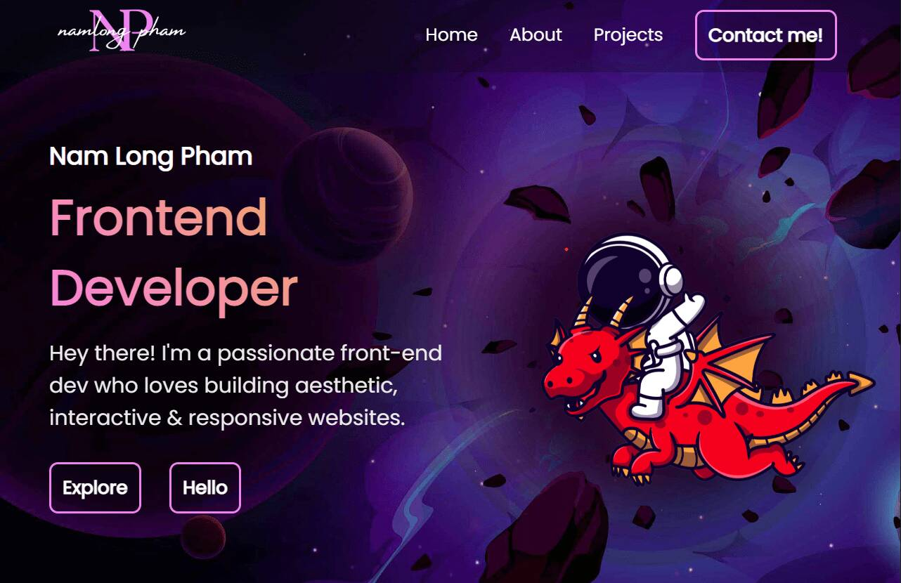

# Portfolio V1



A space-themed portfolio website featuring smooth animation effects and transitions. I wanted to deliver a unique and engaging experience for viewers while getting to know myself and works done.

## Tech stack
- Bootstrapped with [Vitejs](https://vitejs.dev/)
- React
- React Router DOM
- Sass
- GSAP
- Deployed with Vercel

## Running the app

In the project directory, install dependencies:

```
npm install
```
Run the app in the development mode.

```
npm run dev
```
Simply follow the link Vite generated in your terminal, or open in your browser:

[http://localhost:5173](http://localhost:5173) or [http://127.0.0.1:5173](http://127.0.0.1:5173)

The page will reload when you make changes. You may also see any lint errors in the console.

## Artist attribution
Some images in this projects have been slightly modified with Photoshop/Illustrator to fit the overal theme of my website. All original images can be found in src/assets/originals with artist credit/attributions. 
